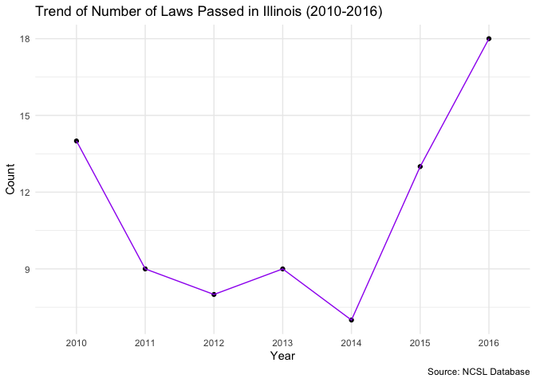
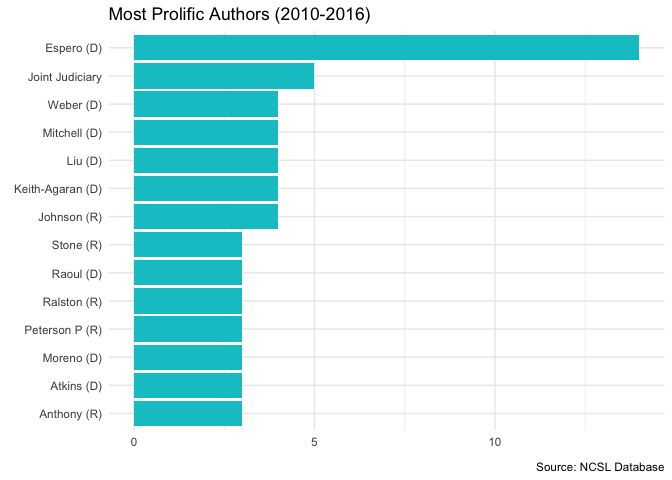

NCSL data analysis
================
Siwei Mao
2022-01-12

-   [Import the data](#import-the-data)
-   [Laws Passed Per Year in Each
    State](#laws-passed-per-year-in-each-state)
-   [Most Common Topics](#most-common-topics)
-   [Most Prolific Authors](#most-prolific-authors)

# Import the data

``` r
law_df <- read.xlsx("/Users/lily1290/Desktop/Python/project - data.xlsx", detectDates = TRUE)
```

# Laws Passed Per Year in Each State

Here, different colors indicate the respective proportion of laws passed
each year.

``` r
law_df$Year <- as.character(law_df$Year)
law_df %>% 
  group_by(Year, State)%>%
  summarize(count = n()) %>%
  ggplot(mapping = aes(x = State, y = count, fill = Year)) +
  geom_col() +
  theme_minimal() +
  theme(axis.text.x = element_text(angle=90, hjust = 1), legend.position=c(0.7, 0.8), legend.direction = "horizontal") +
  labs(title = "Laws Passed Per Year in Each State (2010-2016)", x = "State", y = "Count", caption = "Source: NCSL Database")
```

    ## `summarise()` has grouped output by 'Year'. You can override using the `.groups` argument.

<!-- --> # Trend of
Number of Laws Passed in Illinois I would like to further explore the
historical trend of the number of laws passed in Illinois during
2010-2016.

``` r
law_df %>%
  filter(State == "Illinois") %>%
  group_by(Year) %>%
  summarize(Count = n()) %>%
  ggplot(aes(x = Year, y = Count)) +
  geom_point() +
  geom_line(aes(group=1), color = "purple") +
  theme_minimal() +
  labs(title = "Trend of Number of Laws Passed in Illinois (2010-2016)", caption = "Source: NCSL Database")
```

<!-- -->

# Most Common Topics

``` r
law_df %>%
  #select the columns with the topic names
  select(7:19) %>%
  #calculate the sum of each column, which corresponds to the total number of times each topic appears
  colSums() 
```

    ##                    Budget.and.Oversight    Community.Supervision.Administration 
    ##                                     510                                     461 
    ##          Community.Supervision.Programs    Correctional.Facility.Administration 
    ##                                     294                                     788 
    ##   Diversion.and.Sentencing.Alternatives                         Inmate.Programs 
    ##                                     212                                     180 
    ## Reentry.Barriers.and.Access.to.Services      Reentry.Oversight.and.Organization 
    ##                                     234                                     108 
    ##        Reentry.Programs.and.Supervision                   Release.and.Discharge 
    ##                                     153                                     311 
    ##       Sentencing.and.Criminal.Penalties                 Specialized.Populations 
    ##                                     362                                     269 
    ##                Treatment-Based.Programs 
    ##                                     330

``` r
#create a data frame to prepare for plotting
Topic <- c("Budget and Oversight", "Community Supervision Administration", "Community Supervision Programs", "Correctional Facility Administration", "Diversion and Sentencing Alternatives", "Inmate Programs", "Reentry Barriers and Access to Services", "Reentry OVersight and Organization", "Reentry Programs and Supervision", "Release and Discharge", "Sentencing and Criminal Penalties", "Specialized Populations", "Treatment-Based Programs")
Count <- c(510, 461, 294, 788, 212, 180, 234, 108, 153, 311, 362, 269, 330)

topic_count <- data_frame(Topic, Count)
```

    ## Warning: `data_frame()` was deprecated in tibble 1.1.0.
    ## Please use `tibble()` instead.
    ## This warning is displayed once every 8 hours.
    ## Call `lifecycle::last_lifecycle_warnings()` to see where this warning was generated.

``` r
#use ggplot to visualize the data
topic_count %>%
  ggplot(mapping = aes(Topic, Count)) +
  geom_col(fill = "turquoise3") + 
  theme_minimal() +
  #flip coordinates to make the plot easier to read
  coord_flip() +
  labs(title = "Topics of Laws (2010-2016)", caption = "Source: NCSL Database")
```

<!-- -->

# Most Prolific Authors

Explore the 10 most prolific authors during the 2010-2016 period.

``` r
law_df %>%
  #remove NA values
  drop_na() %>%
  #calculate the number of laws each author/committee has written 
  group_by(Author) %>%
  summarize(Count = n()) %>%
  #use slice_max() to keep the top 10 results
  slice_max(n = 10, order_by = Count) %>%
  ggplot(mapping = aes(fct_reorder(Author, Count), Count)) +
  geom_col(fill = "turquoise3") +
  coord_flip() +
  theme_minimal() +
  labs(title = "Most Prolific Authors (2010-2016)", x = element_blank(), y = element_blank(), caption = "Source: NCSL Database")
```

<!-- -->
